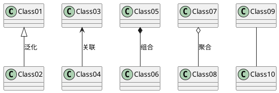

# 类间的关系

UML 图中类之间的关系

* 依赖
* 泛化
* 关联
* 聚合
* 组合
* 实现

## 依赖关系

假设A类的变化引起 B 类的变化，则说明 B 类依赖于 A 类。

依赖关系有以下三种情况：

1. A 类是 B 类中的（某中方法的）局部变量；
2. A 类是 B 类方法当中的一个参数；
3. A 类向 B 类发送消息，从而影响 B 类发生变化；

## 泛化关系

泛化关系也就是继承关系。

## 关联关系

通常将一个类的对象作为另一个类的属性。如客户和订单，每个订单对应特定的客户，每个客户对应一些特定的订单，再入篮球队与球队之间的关系。

1. 双向关联
2. 单向关联
3. 自关联
4. 重数性关联

## 聚合关系

表示的是整体和部分的关系，整体与部分可以分开。

聚合关系是“has-a”关系

在聚合关系中，成员类是整体类的一部分，即成员对象是整体对象的一部分，但是成员对象可以脱离整体对象独立存在。

电脑包括键盘、显示器，一台电脑可以和多个键盘、多个显示器搭配，确定键盘和显示器是可以和主机分开的，主机可以选择其他的键盘、显示器组成电脑；

## 组合关系

整体与部分的关系，但是整体与部分不可以分开。

组合关系是“contains-a”关系

组合关系中部分和整体具有统一的生存期。

## 实现关系

接口和类的实现关系

## 关系之间的区别

### 聚合与组合

* 聚合与组合都是一种结合关系，只是额外具有整体-部分的意涵。

* 部件的生命周期不同
    聚合关系中，整件不会拥有部件的生命周期，所以整件删除时，部件不会被删除。再者，多个整件可以共享同一个部件。
    组合关系中，整件拥有部件的生命周期，所以整件删除时，部件一定会跟着删除。而且，多个整件不可以同时间共享同一个部件。
* 聚合关系是“has-a”关系，组合关系是“contains-a”关系。

### 关联和聚合

* 表现在代码层面，和关联关系是一致的，只能从语义级别来区分。
* 关联和聚合的区别主要在语义上，关联的两个对象之间一般是平等的，例如你是我的朋友，聚合则一般不是平等的。
* 关联是一种结构化的关系，指一种对象和另一种对象有联系。
* 关联和聚合是视问题域而定的，例如在关心汽车的领域里，轮胎是一定要组合在汽车类中的，因为它离开了汽车就没有意义了。但是在卖轮胎的店铺业务里，就算轮胎离开了汽车，它也是有意义的，这就可以用聚合了。

### 关联和依赖

* 关联关系中，体现的是两个类、或者类与接口之间语义级别的一种强依赖关系，比如我和我的朋友；这种关系比依赖更强、不存在依赖关系的偶然性、关系也不是临时性的，一般是长期性的，而且双方的关系一般是平等的。
* 依赖关系中，可以简单的理解，就是一个类A使用到了另一个类B，而这种使用关系是具有偶然性的、临时性的、非常弱的，但是B类的变化会影响到A。

### 综合比较

这几种关系都是语义级别的，所以从代码层面并不能完全区分各种关系；但总的来说，后几种关系所表现的强弱程度依次为：

**组合>聚合>关联>依赖**；

